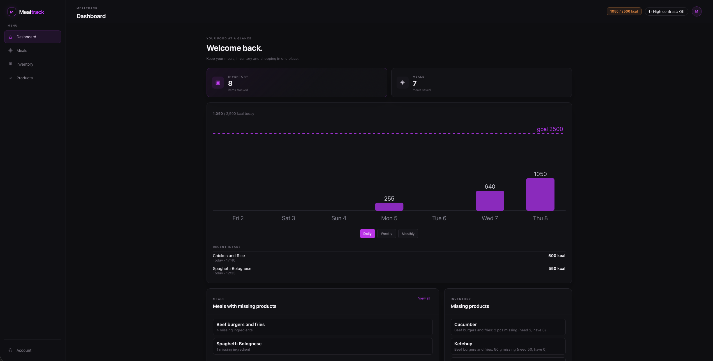
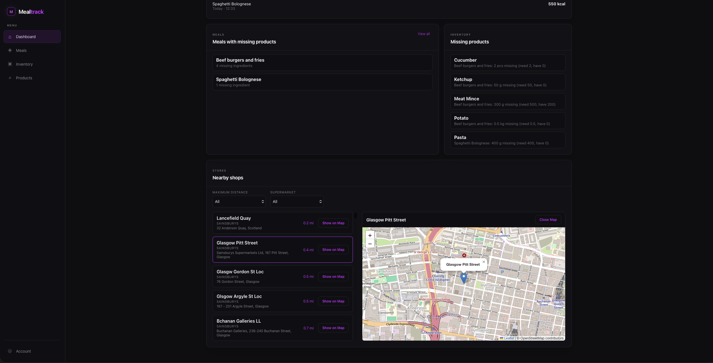
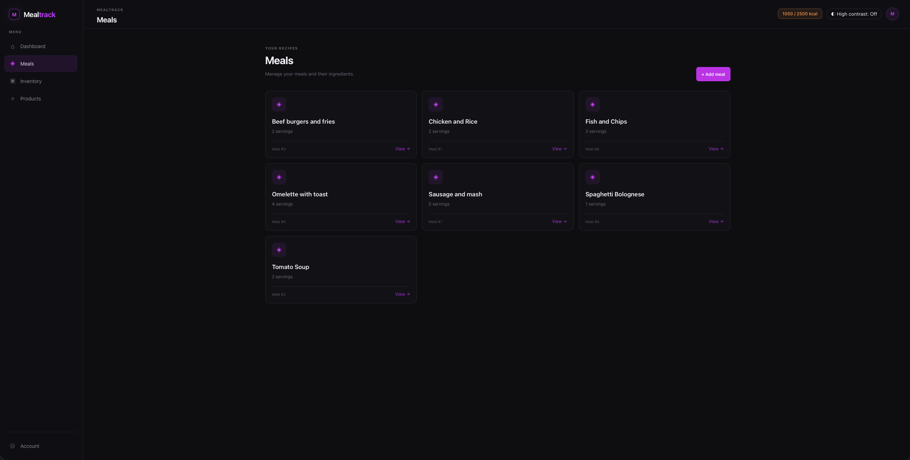
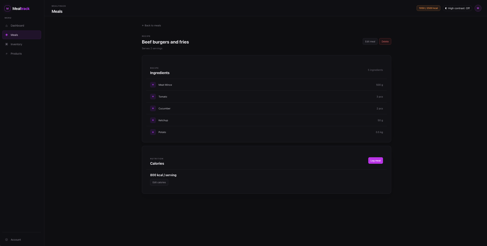
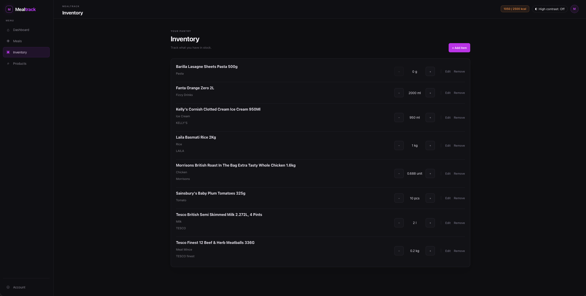
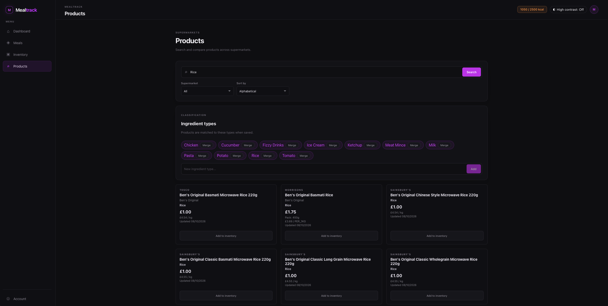

# Mealtrack

A full-stack meal planning and inventory management application that connects meals, ingredients, products, and household inventory into one consistent system.

## The problem it solves

Planning meals becomes awkward when recipes, ingredients, supermarket products, and the food already at home are all managed separately.

Mealtrack connects these pieces together. Users can create meals and their ingredients, maintain their inventory, search supermarket products, and identify which ingredients are missing for their planned meals.

The application integrates supermarket product data from Morrisons, Tesco and Sainsbury's and normalises it into a consistent product model.

## Screenshots

## Running locally

**Requirements:** Python 3.11+, Node.js 22+, and Docker with Compose.

### Docker

Clone the repository and start the full application:

    git clone https://github.com/rr4ph/Mealtrack.git
    cd Mealtrack
    docker compose up --build

This starts the frontend, backend API, and PostgreSQL database.

Open `http://localhost` to use the application.

Swagger UI is available at `http://localhost:8000/docs`.

### Local development

For local development, start the backend:

    uvicorn backend.src.main:app --reload

Then, in a second terminal:

    cd frontend
    npm install
    npm run dev

The frontend is available at `http://localhost:5173`.

### Testing

Backend tests:

    python -m pytest tests/backend

Frontend tests:

    cd frontend
    npm test

Frontend production build:

    cd frontend
    npm run build

## Technology stack

| Area | Technology |
|---|---|
| Backend | Python, FastAPI |
| Database | PostgreSQL |
| Database access | psycopg / raw SQL |
| Frontend | React, TypeScript, Vite |
| Backend testing | pytest |
| Frontend testing | Vitest, React Testing Library |
| API documentation | OpenAPI / Swagger UI |
| Deployment | Docker, Docker Compose, nginx |
| CI | GitHub Actions |

## Testing & CI

Automated testing covers the backend, frontend, API behaviour, database operations, inventory logic, meal management, product integrations, and application builds.

| Area | Tools | Coverage |
|---|---|---|
| Backend | pytest | API, database operations, inventory, meals, products, shortages, supermarket integrations |
| Frontend | Vitest, React Testing Library | Components, pages, and UI behaviour |
| Type checking | TypeScript | Type safety |
| Build | Vite | Production frontend build |
| CI | GitHub Actions | Backend tests, frontend tests, and production build on pushes to `main` and pull requests |

The backend test suite runs against PostgreSQL. GitHub Actions provisions a PostgreSQL service, initializes the database schema, and runs the backend test suite. The CI pipeline also runs the frontend tests and verifies the production frontend build.

## API documentation

Mealtrack exposes a documented REST API using OpenAPI and provides Swagger UI for interactive exploration.

When running locally, start the backend and visit:

`http://localhost:8000/docs`

The Swagger UI provides interactive documentation for the available endpoints, including their parameters, request bodies, responses, and schemas.

## Notes

Built by [Mykyta Podoltsev](https://github.com/rr4ph) as a pantry management tool and Software Engineering portfolio project.

The application is designed around the relationship between meals, ingredients, products and inventory, with supermarket integrations providing external product data.

Repository: [https://github.com/rr4ph/mealtrack](https://github.com/rr4ph/mealtrack)
